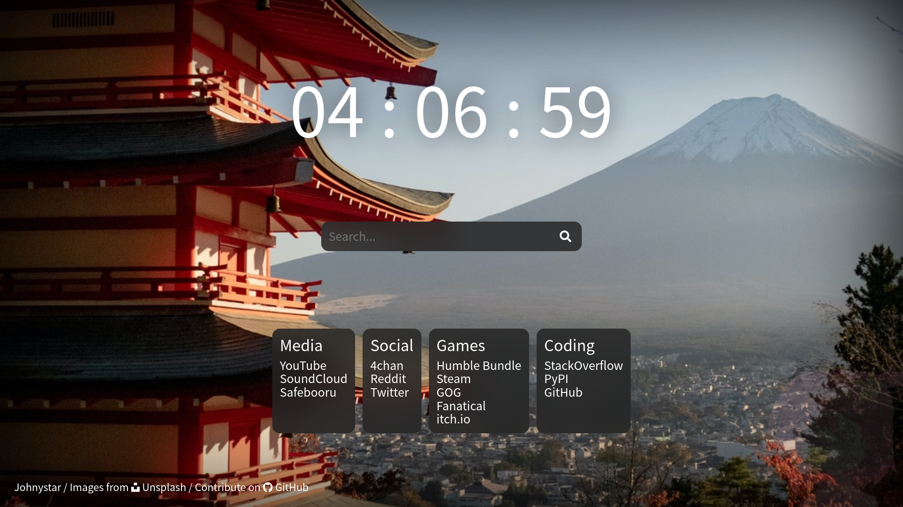
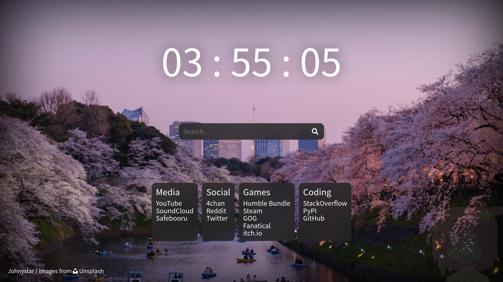
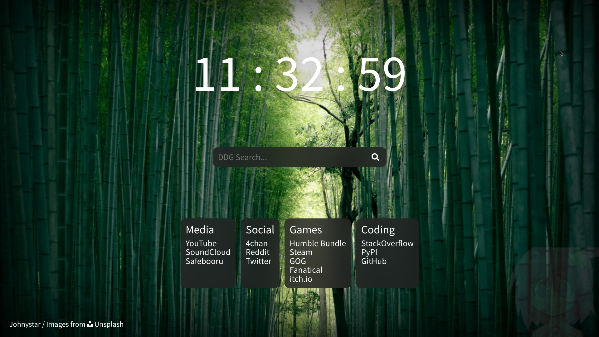
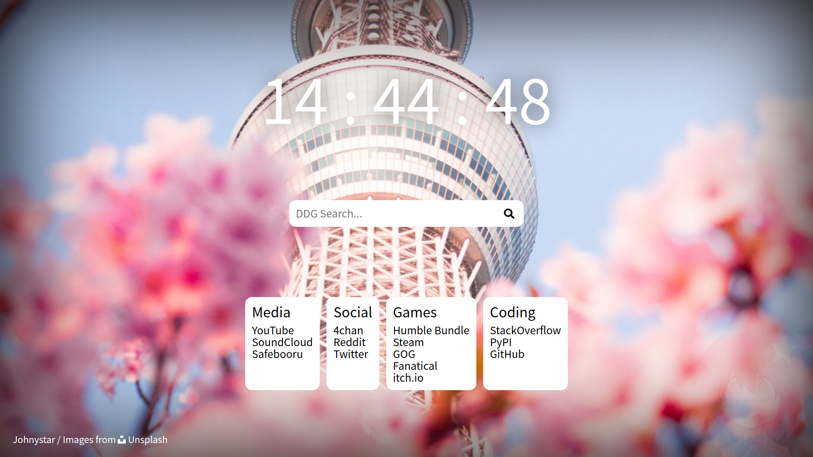

# Startpage

A quick port of what used to be my closed-source start page running on my home server.

## Planned

- [x] light/dark based on browser prefference
- [ ] search engine choice

## Notes

- ``favicon.ico`` is a renamed copy of ``icon.png``
- ~~dark mode blur doesn't work in Firefox: [bugzilla 1578503](https://bugzil.la/1578503)~~ this has been fixed since!

## Old screenshots

